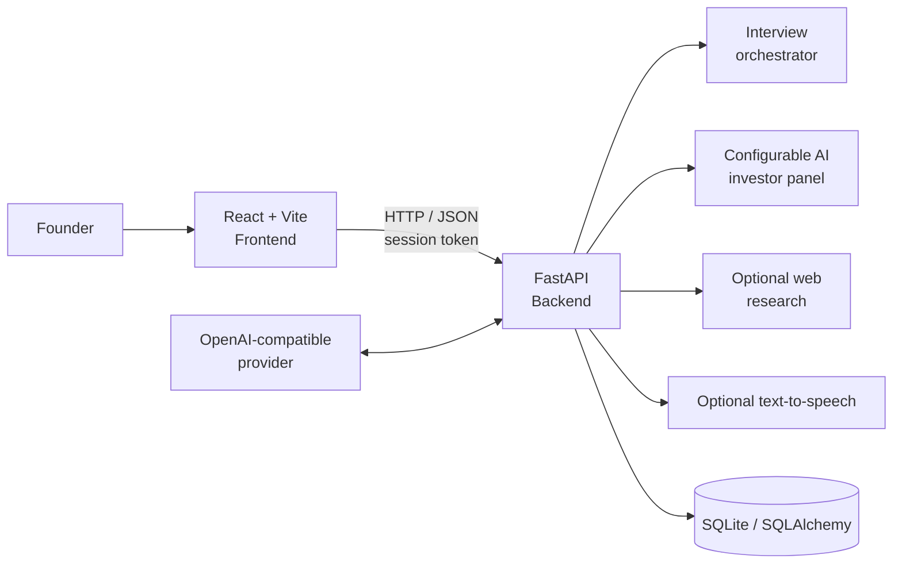
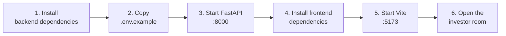
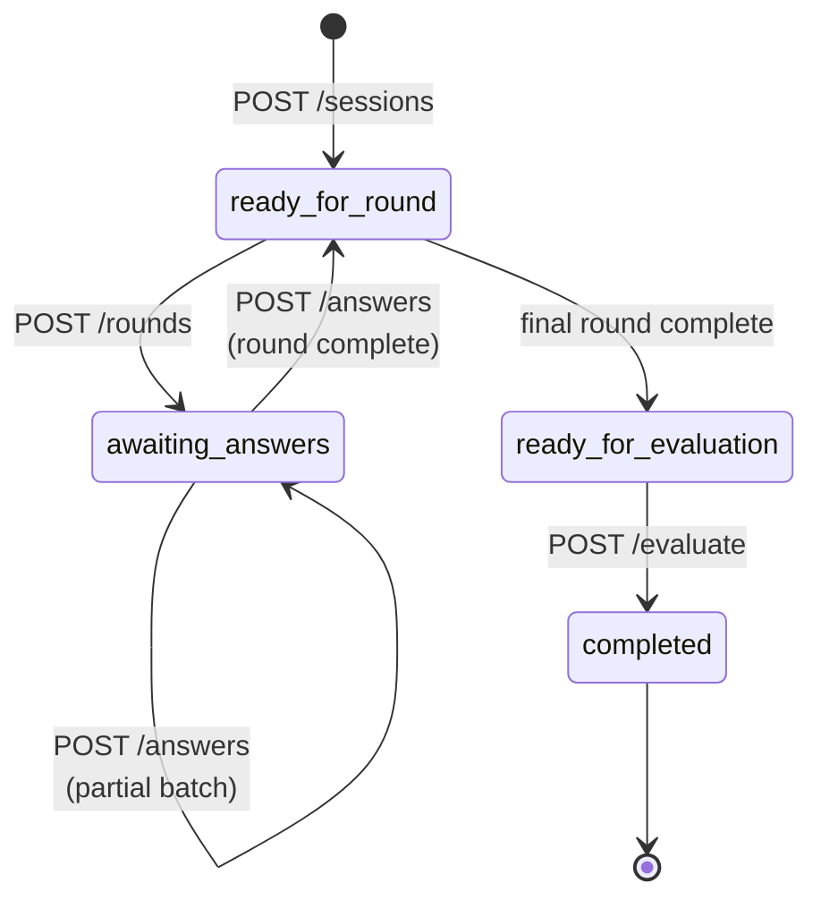

# PitchLab

<p align="center">
  <strong>Practice the pitch. Pressure-test the story. Leave investor-ready.</strong>
</p>

<p align="center">
  <em>An AI-powered investor room for founders who want sharper answers and stronger pitches.</em>
</p>

<p align="center">
  
  
  
  
  
</p>

<p align="center">
  <a href="#quick-start">Quick start</a> ·
  <a href="#api-workflow">API workflow</a> ·
  <a href="#development-and-verification">Development</a>
</p>

PitchLab is an AI-powered investor-room simulator for startup founders. It guides a founder through a structured pitch, coordinated questioning from a configurable panel of AI investors, round-by-round coaching, and a final investment-style evaluation.

The repository contains:

- **Frontend** — a React 19 and Vite application with a premium dark investor-room interface, voice controls, live transcript UI, session archive screens, and evaluation views.
- **Backend** — a FastAPI service that owns the interview workflow, AI-provider integration, configuration, persistence, access control, web research, and optional text-to-speech generation.

> **Project status:** The backend is fully wired for demo mode and OpenAI-compatible providers. The frontend includes the live API-backed pitch flow alongside mock data used by several dashboard and archive views.

## Features

| Capability | What it gives founders |
| --- | --- |
| 🎙️ **Live pitch room** | A focused boardroom experience with live captions, transcript, and voice controls. |
| 🧠 **AI investor panel** | Multiple configurable personas challenge a pitch from finance, market, product, strategy, and technical perspectives. |
| 🧭 **Orchestrated rounds** | An optional moderator plans the objective and briefs investors before each round. |
| 🔎 **Evidence-aware research** | Server-side, bounded web snippets can add relevant market context without exposing provider keys. |
| 📝 **Round coaching** | Strengths, concerns, and recommendations arrive after each completed Q&A round. |
| 📊 **Weighted evaluation** | Configurable criteria, investor weights, score ranges, and investment thresholds produce a final panel verdict. |
| 🔊 **Voice output** | Browser speech synthesis works locally; optional provider TTS can generate protected MP3 responses. |
| 🔐 **Private sessions** | One-time session tokens, expected-version writes, CORS controls, and admin protection keep sessions isolated. |
| ⚡ **Demo-ready** | Deterministic demo mode runs immediately without paid AI calls or external credentials. |

## Architecture



| Layer | Responsibility | Key technologies |
| --- | --- | --- |
| **Experience** | Dashboard, pitch setup, live room, transcript, voice controls, sessions, and reports | React 19, TypeScript, Tailwind CSS, Vite |
| **Application API** | Validation, interview stages, concurrency, auth headers, errors, and health checks | FastAPI, Pydantic, Uvicorn |
| **AI adapters** | Demo responses, compatible chat completions, web snippets, and optional TTS | HTTPX, OpenAI-compatible APIs |
| **Persistence** | Sessions, transcripts, configuration snapshots, round analyses, and evaluations | SQLAlchemy, SQLite |

The backend is the source of truth for interview state. The frontend stores the session token locally so a founder can resume the latest session from the same browser. Provider credentials remain server-side and are never returned in public configuration responses.

## Requirements

| Requirement | Version | Why |
| --- | --- | --- |
| Python | **3.11+** | Runs the FastAPI backend |
| Node.js | **18+** | Runs the Vite frontend |
| npm or Bun | Current | Installs frontend dependencies |
| Modern browser | Chrome or Edge recommended | Enables the broadest Web Speech API support |
| AI provider account | Optional | Demo mode needs no external account |

## Quick start

Run the backend and frontend in separate terminals:



| Service | Local URL | Start command |
| --- | --- | --- |
| Backend API | `http://127.0.0.1:8000` | `python -m uvicorn main:app --reload` |
| Swagger UI | `http://127.0.0.1:8000/docs` | Available when `API_DOCS_ENABLED=true` |
| Frontend | `http://localhost:5173` | `npm run dev` |

### 1. Start the backend

From the repository root in PowerShell:

```powershell
cd Backend
py -m venv .venv
.venv\Scripts\python.exe -m pip install -r requirements-dev.txt
Copy-Item .env.example .env
.venv\Scripts\python.exe -m uvicorn main:app --reload
```

The API is available at `http://127.0.0.1:8000`.

- Swagger UI: `http://127.0.0.1:8000/docs`
- OpenAPI schema: `http://127.0.0.1:8000/openapi.json`
- Liveness: `http://127.0.0.1:8000/health/live`
- Readiness: `http://127.0.0.1:8000/health/ready`

The default configuration uses `API_AI_PROVIDER=demo`, so the application starts without contacting an external AI provider.

### 2. Start the frontend

In a second PowerShell terminal:

```powershell
cd Frontend
npm install
npm run dev
```

Open `http://localhost:5173`.

The frontend defaults to `http://localhost:8000` for the API. To use a different backend URL, create `Frontend/.env.local`:

```dotenv
VITE_API_BASE_URL=http://localhost:8000
# Optional shared client credential. Do not use this for a secret that must remain private
# in a public browser bundle.
VITE_API_CLIENT_KEY=
# Only use this for a trusted internal/admin build.
VITE_API_ADMIN_KEY=
```

### 3. Run a production frontend build

```powershell
cd Frontend
npm run build
npm run preview
```

The build runs TypeScript checking before creating the Vite bundle.

## Backend configuration

Copy `Backend/.env.example` to `Backend/.env`. Important settings include:

| Variable | Purpose | Default |
| --- | --- | --- |
| `API_AI_PROVIDER` | Provider adapter mode. Use `demo` or `openai_compatible`. | `demo` |
| `API_AI_BASE_URL` | OpenAI-compatible provider base URL. | `https://api.openai.com/v1` |
| `API_AI_MODEL` | Default chat model. | empty in demo mode |
| `API_AI_API_KEY` | Server-side provider credential. | empty |
| `API_AI_JSON_MODE` | Request structured JSON responses when supported. | `true` |
| `API_TTS_ENABLED` | Enable optional provider-generated MP3 speech. | `false` |
| `API_WEB_ACCESS_ENABLED` | Allow configured agents to use server-side web snippets. | `true` |
| `API_ADMIN_KEY` | Required for configuration writes. | empty |
| `API_CLIENT_KEY` | Optional shared key for application routes. | empty |
| `API_CORS_ORIGINS` | JSON array of allowed browser origins. | localhost ports |
| `API_DATABASE_URL` | SQLAlchemy database URL. | SQLite file |
| `API_CONFIG_FILE` | Optional seed configuration for a new database. | empty |
| `API_MAX_CONCURRENT_AI_CALLS` | Per-process provider concurrency limit. | `4` |
| `API_DOCS_ENABLED` | Enable FastAPI documentation endpoints. | `true` |

### Connect an AI provider

For an OpenAI-compatible provider, update `Backend/.env`:

```dotenv
API_AI_PROVIDER=openai_compatible
API_AI_BASE_URL=https://your-provider.example/v1
API_AI_MODEL=your-model
API_AI_API_KEY=your-server-side-key
API_AI_JSON_MODE=true
API_AI_TOKEN_PARAMETER=max_tokens
```

The backend appends `/chat/completions` to the configured base URL. Provider feature support differs, so set `API_AI_JSON_MODE=false` or change `API_AI_TOKEN_PARAMETER` when required by the provider.

Optional text-to-speech configuration:

```dotenv
API_TTS_ENABLED=true
API_TTS_BASE_URL=https://your-provider.example/v1
API_TTS_API_KEY=your-server-side-key
API_TTS_MODEL=your-tts-model
API_TTS_VOICE=your-voice
```

TTS failures do not fail an interview response: the text remains available and the audio field is empty.

### Configure the investor panel

`Backend/simulation.example.json` is a complete configuration seed:

| Configuration area | Controls |
| --- | --- |
| Orchestrator | Moderator identity, instructions, round objective, and private investor briefings |
| Investor panel | Personas, roles, expertise, assertiveness, risk tolerance, models, and voting weights |
| Interview shape | Difficulty, number of rounds, questions per investor, and response limits |
| Scoring rubric | Criteria, positive weights, score range, and investment threshold |
| Research and reliability | Web limits, AI timeouts, retries, and retry backoff |
| Coaching and evaluation | Round feedback, final report, and shared investor instructions |

To seed a new database:

```dotenv
API_CONFIG_FILE=simulation.example.json
```

Configuration changes affect new sessions only. Existing sessions retain the configuration snapshot and scoring rubric they started with.

## API workflow

All application endpoints are under `/api/v1`.



| Method | Endpoint | Description |
| --- | --- | --- |
| `GET` | `/config` | Read the current simulation configuration and revision. |
| `PUT` | `/config` | Update configuration with `X-Admin-Key` and an expected revision. |
| `POST` | `/sessions` | Create a pitch session and receive a one-time session token. |
| `GET` | `/sessions/{id}` | Read the current session, transcript, analyses, and evaluation. |
| `POST` | `/sessions/{id}/rounds` | Generate the next panel questioning round. |
| `POST` | `/sessions/{id}/answers` | Submit answers for pending questions. |
| `POST` | `/sessions/{id}/evaluate` | Generate the final evaluation after all rounds. |
| `DELETE` | `/sessions/{id}` | Delete a session using its token and expected version. |

Typical lifecycle:

| Step | Request | Result |
| ---: | --- | --- |
| 1 | `POST /sessions` | Creates the pitch and returns a one-time token. |
| 2 | `POST /sessions/{id}/rounds` | Generates coordinated investor questions. |
| 3 | `POST /sessions/{id}/answers` | Stores partial or complete answers and round coaching. |
| 4 | Repeat steps 2–3 | Continues until the configured rounds are complete. |
| 5 | `POST /sessions/{id}/evaluate` | Generates the final scores, feedback, and verdict. |

Every mutating session request includes the latest `expected_version`. The backend rejects stale writes with `409`, preventing two browser actions from overwriting one another. Send the returned session token as:

```http
X-Session-Token: <token>
```

The token is returned only when the session is created. Treat it like a password.

### Create a session

```json
{
  "business_name": "FreshBox",
  "summary": "A subscription service delivering affordable surplus produce from local farms.",
  "industry": "Food technology",
  "target_customers": "Urban families looking for affordable fresh produce",
  "revenue_model": "Monthly subscriptions",
  "traction": "50 paying pilot customers",
  "funding_ask": 50000,
  "equity_offered_percent": 10,
  "currency": "USD"
}
```

Only `business_name` and `summary` are required. A complete endpoint contract is available in the backend Swagger UI and [Backend/README.md](./Backend/README.md).

## Frontend structure

```text
Frontend/src/
  App.tsx                    Application routes and page composition
  components/
    boardroom/               Investor room, transcript, captions, and controls
    layout/                  Sidebar, header, and application shell
  data/mockData.ts           UI fixture data for non-live views
  pages/                     Dashboard, pitch, session, insight, and settings screens
  services/
    api.ts                   Typed backend client and session-token handling
    speech.ts                Browser speech recognition and synthesis helpers
  types/index.ts             Shared frontend domain types
  index.css                  Tailwind and application styling
```

The live-room page calls the backend for session creation, rounds, answers, and evaluation. Browser speech recognition is used for dictation when supported; browser speech synthesis can provide a local fallback for spoken responses.

## Development and verification

### Backend tests and linting

```powershell
cd Backend
.venv\Scripts\python.exe -m pytest -q
.venv\Scripts\python.exe -m ruff check app main.py tests
.venv\Scripts\python.exe -m ruff format --check app main.py tests
```

Provider calls are mocked in tests, so the suite does not make paid AI requests.

### Frontend type check and build

```powershell
cd Frontend
npm run build
```

### Useful development commands

```powershell
# Backend with automatic reload
cd Backend
.venv\Scripts\python.exe -m uvicorn main:app --reload

# Frontend development server
cd Frontend
npm run dev

# Preview the production frontend bundle
npm run preview
```

## Reliability, privacy, and deployment notes

| Area | Guidance |
| --- | --- |
| **Secrets** | Keep AI keys, admin keys, and provider URLs in the backend environment. Never ship them in a public frontend build. |
| **Transport** | Use HTTPS outside local development. |
| **Session access** | A session token grants access to its pitch; store it securely and never log it. |
| **Browser access** | Set `API_CORS_ORIGINS` to the exact deployed frontend origins. |
| **Database** | Use a persistent volume. SQLite startup initialization creates missing tables but is not a migration system. |
| **Web research** | Research is server-side and bounded by configured result and character limits. |
| **Provider costs** | Retries can result in additional AI-provider charges. |
| **Health checks** | Liveness and readiness checks do not call the AI provider. |

For backend-specific API semantics, error codes, concurrency behavior, database guidance, and deployment details, see [Backend/README.md](./Backend/README.md).

## Repository guide

| Path | Description |
| --- | --- |
| [Backend/](./Backend/) | FastAPI application, configuration, tests, database, and provider adapters |
| [Backend/README.md](./Backend/README.md) | Detailed backend API and operational reference |
| [Backend/.env.example](./Backend/.env.example) | Backend environment template |
| [Backend/simulation.example.json](./Backend/simulation.example.json) | Example investor panel and scoring configuration |
| [Frontend/](./Frontend/) | React/Vite application |
| [Frontend/package.json](./Frontend/package.json) | Frontend scripts and dependencies |
| [Frontend/design.md](./Frontend/design.md) | UI/UX design system and product specification |

## Contributing

1. Create a focused branch for your change.
2. Keep backend contracts and frontend types synchronized.
3. Add or update tests for backend behavior changes.
4. Run the backend checks and frontend build before opening a pull request.
5. Never commit `.env` files, API keys, generated audio, local databases, or dependency directories.

## License

No license file is currently included in this repository. Until a license is added, all rights remain with the repository owner.
